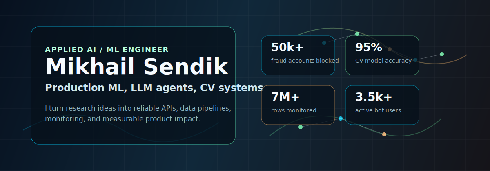
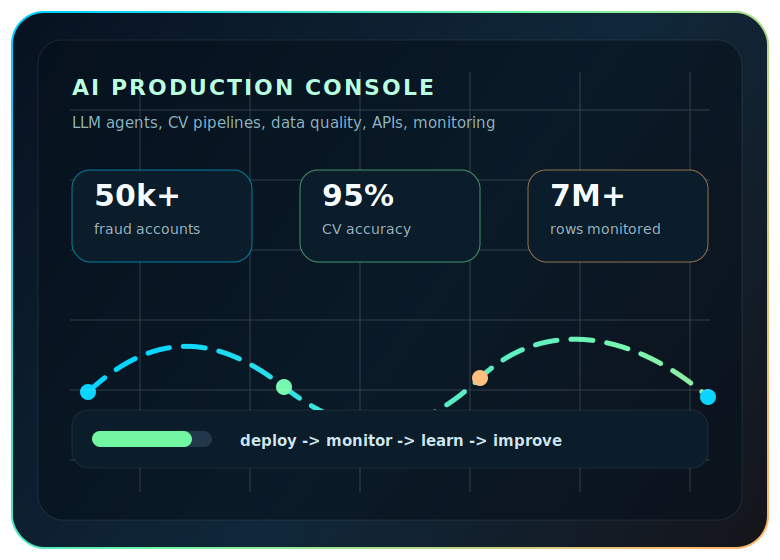

  

  

  
  
  
  

  
  

 

<table>
  <tr>
    <td width="54%" valign="top">
      <h2>Signal</h2>
      

        I am <b>Mikhail Sendik</b>, an ML Engineer building production-grade Applied AI:
        classical ML, LLM/NLP systems, computer vision pipelines, API services,
        monitoring, and MLOps.
      

      

        My strongest zone is the place where models become products:
        data pipelines, model quality, backend contracts, deployment,
        monitoring, and measurable business impact.
      

      <pre lang="python"><code>class MikhailSendik:
    role = "ML Engineer / Applied AI Engineer"
    base = ["classical ML", "feature engineering"]
    current = ["LLM agents", "RAG", "Text-to-SQL", "CV"]
    ships_with = ["FastAPI", "Docker", "Airflow", "ClickHouse"]</code></pre>
    </td>
    <td width="46%" valign="top">
      
    </td>
  </tr>
</table>

## Impact Board

| Metric | Production Result |
|---:|---|
| **50,000+** | bot accounts blocked by anti-fraud analytics |
| **7M+ rows** | monitored in production datasets |
| **1 day -> 1 hour** | reporting time after LLM analytics agent |
| **10,000+** | avatar generation API requests served |
| **70,000+ images** | custom CV dataset for food segmentation |
| **95%** | CV accuracy across 100+ food categories |
| **3,500+** | active users in a multi-agent Telegram AI platform |
| **8.3% MAPE** | CatBoost real estate valuation model |

## Tech Arsenal

  

  
  
  
  
  
  
  
  
  

## Systems I Build

<table>
  <tr>
    <td width="50%">
      <h3>LLM Agents and Analytics</h3>
      
Gemma/GPT-based agents for HTML parsing, SQL generation, report automation, RAG, and prompt-controlled workflows.

      
  

    </td>
    <td width="50%">
      <h3>Computer Vision Products</h3>
      
UNet++, OpenCV, MediaPipe, GAN, detection, segmentation, pose estimation, vector search, and production inference APIs.

      
  

    </td>
  </tr>
  <tr>
    <td width="50%">
      <h3>Production ML Platforms</h3>
      
FastAPI services, Docker deployments, dataset monitoring, model versioning, experiment tracking, and CI/CD-ready ML components.

      
  

    </td>
    <td width="50%">
      <h3>Classical ML and Data</h3>
      
CatBoost, scikit-learn, tabular modeling, feature engineering, ETL, PostgreSQL, ClickHouse, Qdrant, and analytical pipelines.

      
  

    </td>
  </tr>
</table>

## Featured Repositories

  
  

## GitHub Telemetry

  
  

  

<picture>
  <source media="(prefers-color-scheme: dark)" srcset="https://raw.githubusercontent.com/Uutotora/Uutotora/output/github-snake-dark.svg" />
  <source media="(prefers-color-scheme: light)" srcset="https://raw.githubusercontent.com/Uutotora/Uutotora/output/github-snake.svg" />
  
</picture>

## Current Vector

I am looking for **ML Engineer / Applied AI Engineer** roles where the work is technical, product-facing, and measurable: models that have to run, APIs that have to hold, and analytics that have to change decisions.

  

